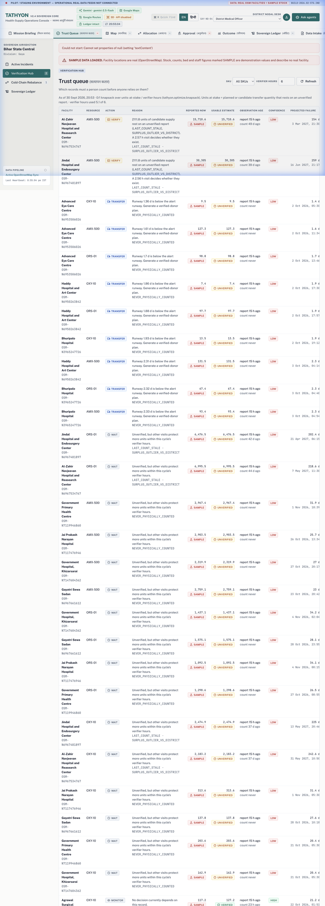
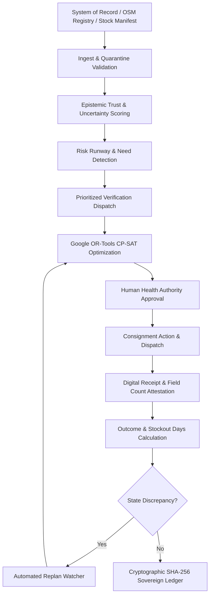
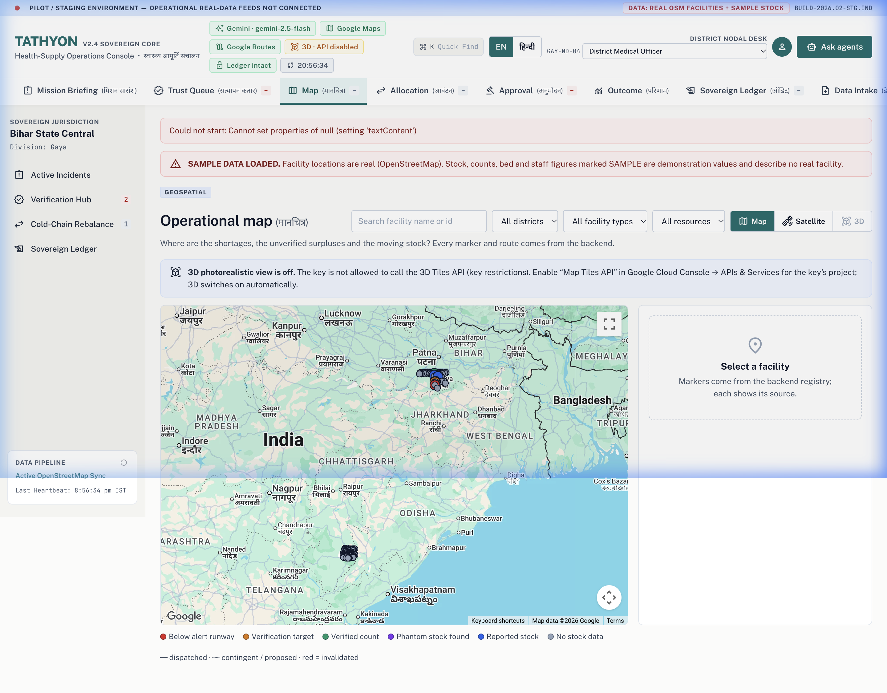
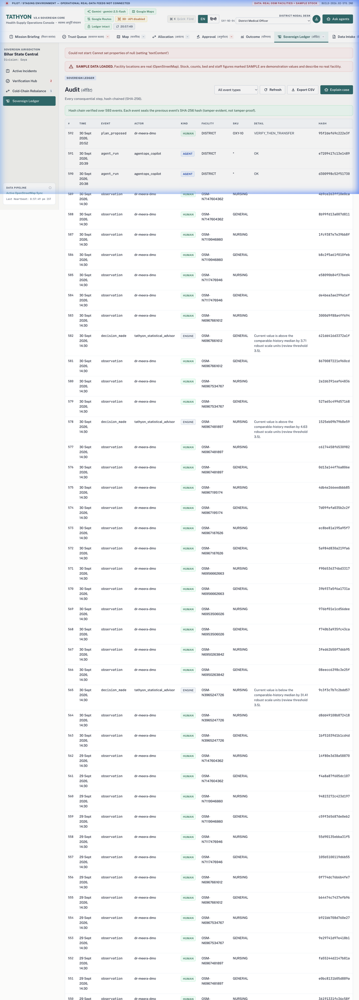

# TATHYON

**Sovereign Healthcare Supply-Chain Resilience & Verification Decision System**

> *Verify before you trust. Decide before you dispatch.*

[](https://www.python.org/)
[](https://fastapi.tiangolo.com)
[](https://ai.google.dev/)
[](https://developers.google.com/maps)
[](https://developers.google.com/optimization)
[](#security)
[](#evaluation)
[](LICENSE)

---



---

## The Problem

Public healthcare logistics across developing nations face a chronic, systemic failure: **the mismatch between inventory records and physical reality**.

In district health networks spanning hundreds of Primary Health Centres (PHCs) and Community Health Centres (CHCs):
- Stock registers, digital portals, and monthly rollups frequently report medicines that are expired, damaged, pilfered, or trapped in broken cold chains (**phantom stock**).
- Routine decision systems dispatch emergency reallocations based on unverified digital counts. When courier vehicles arrive at remote clinics after hours of difficult transport, the supposed donor stock does not exist.
- Meanwhile, critical stockouts at neighboring facilities trigger preventable patient complications, maternal health emergencies, and vaccine spoilage.

## The Insight

$$\text{Reported Stock} \neq \text{Trusted Stock}$$

Treating every ledger entry as ground truth leads to cascading logistics failures.

TATHYON introduces a **verification-before-dispatch paradigm**:
1. **Calculate epistemic uncertainty:** Quantify how much decay, reporting latency, and past discrepancy erode confidence in a reported stock level.
2. **Prioritize human verifications:** Before ordering an expensive inter-facility transfer, target low-cost physical verifications (e.g., telephone verification, community health worker inspection) at pivotal donor facilities.
3. **Guard safety floors:** Never reallocate stock from a donor facility if doing so jeopardizes that clinic's own local population safety threshold.

---

## What TATHYON Does

TATHYON is a resilient, bounded decision system operating above existing national registry infrastructure. It continuously computes supply-chain risk runways, schedules prioritized field verifications, generates mathematically provable reallocation plans via Google OR-Tools, and records every operational decision in a tamper-evident, cryptographic append-only ledger.

### The Closed-Loop Architecture



---

## Why Existing Systems Are Not Replaced

TATHYON is **not** an electronic medical records (EMR) system or a warehouse ERP. It does not replace existing national supply systems such as India's DVDMS (e-Aushadhi), CoWIN, or OpenLMIS.

Instead, TATHYON acts as a **sovereign decision and resilience layer**:
- Ingests exports from heterogeneous systems of record without requiring API rewrites.
- Quarantines mathematically suspicious or malformed records.
- Injects ground-truth physical verification checks before expensive logistical actions are triggered.
- Protects regional health officers from blindly trusting stale digital counts.

---

## AI Agents & Sovereign Boundaries

TATHYON employs five bounded, specialized agents. In strict accordance with public health safety principles, **AI agents propose and explain; deterministic mathematical engines and authorized human officers decide.**

| Agent | Purpose | Allowed Tools | Strict Boundaries (Cannot Do) |
|---|---|---|---|
| **Intake Agent** | Parses unstructured manifests, voice dictation, SMS reports, and paper register photos. | `extract_inventory_manifest`, `validate_sku_catalog` | **Cannot** approve inventory into the trusted ledger without human sign-off. |
| **Operations Copilot** | Answers operational inquiries from health officers on queue status and rejection reasons. | `read_queue_metrics`, `query_donor_safety_rules`, `read_audit_events` | **Cannot** dispatch consignments or modify verification states. |
| **Resilience Analyst** | Models multi-district supply chain stress scenarios (+30% demand surges, monsoon disruptions). | `simulate_demand_shock`, `evaluate_cold_chain_thresholds` | **Cannot** overwrite active operational parameters or baseline reserves. |
| **Replan Watcher** | Continuously audits active transfer proposals against newly attested field counts. | `check_plan_feasibility`, `draft_replan_proposal` | **Cannot** execute replans automatically; requires explicit human authorization. |
| **Evidence / Audit Agent** | Traces forensic provenance of decisions, producing verifiable incident timelines. | `verify_hash_chain`, `export_tamper_evident_trail` | **Cannot** mutate or reorder historical ledger events. |

---

## AI & Optimization Architecture

- **Language Intelligence:** Google Gemini 2.5 Flash SDK parses unstructured logistics data, generates human-readable incident summaries, and translates operational briefings into Hindi and English. If the Gemini API is unreachable, the system automatically falls back to deterministic rule-based explanations (`DETERMINISTIC FALLBACK`).
- **Mathematical Allocation:** Google OR-Tools CP-SAT formulation solves multi-facility, multi-SKU reallocation with:
  - Strict donor safety floor constraints (preventing secondary stockouts).
  - Cold-box thermal transport constraints (hours of transit autonomy).
  - Maximum transfer distance and vehicle payload capacity limits.
- **Epistemic Trust Engine:** Deterministic decay models calculate stock confidence as a function of observation age, reporter role hierarchy, and past reconciliation discrepancies.

---

## Spatial Infrastructure: Google Maps Platform & 3D



- **Google Maps JavaScript API:** Renders interactive satellite, terrain, and road networks for spatial cold-chain situational awareness across rural and semi-urban health facilities.
- **Google Routes API:** Calculates real road driving distances, elevation, and terrain travel times between District Hospitals (DH), Sub-Divisional Hospitals (SDH), and Primary Health Centres (PHC).
- **CesiumJS & Google Photorealistic 3D Tiles:** Supports spatial terrain immersion for evaluating cold-chain aerial logistics and high-altitude transport bottlenecks.
  - *Data Reality Note:* Real 3D Photorealistic Tiles require Google Cloud Map Tiles API activation on the GCP project. When the API is not enabled, TATHYON cleanly surfaces a `3D · API disabled` status badge and maintains full operational functionality on the 2D GIS satellite view without simulation or placeholder pins.

---

## Verification & Cryptographic Ledger



Every transaction—from inventory ingestion and field count attestation to human officer approvals and shipment receipts—is appended to an immutable SHA-256 hash-chained ledger. Any tampering or retroactive modification immediately breaks the chain and alerts the operations console.

---

## Quick Start

### 1. Prerequisites
- Python 3.11+
- Node.js 18+ (for client dependencies if building assets; pre-bundled assets included)

### 2. Installation
```bash
git clone https://github.com/jaisogani-ai/GOGLE-2026-Code-for-Communities.git
cd GOGLE-2026-Code-for-Communities

# Create and activate virtual environment
python3 -m venv .venv
source .venv/bin/activate

# Install dependencies
pip install -r requirements.txt
```

### 3. Configuration
Copy the template configuration file:
```bash
cp .env.example .env
```
Edit `.env` with your credentials:
```ini
# AI Engine
GEMINI_API_KEY=your_gemini_api_key_here

# Google Maps Platform (Separate browser and server keys recommended)
GOOGLE_MAPS_BROWSER_KEY=your_maps_browser_key_here
GOOGLE_MAPS_SERVER_KEY=your_maps_server_key_here
```

### 4. Running the System
```bash
# Launch FastAPI backend & console server
uvicorn api.main:app --host 127.0.0.1 --port 8088 --reload
```
Open your browser at `http://127.0.0.1:8088` to access the Sovereign Operations Console.

---

## Data Reality Matrix

| Component | Source / Methodology | Status | Notes |
|---|---|---|---|
| **Facility Registries** | OpenStreetMap (Overpass API) | **REAL** | Real health facilities across Gaya (Bihar), Bastar (Chhattisgarh), Koraput (Odisha), and Raichur (Karnataka). |
| **Geographic Distances** | Google Routes API / Haversine fallback | **REAL** | Real road travel times and distance calculations. |
| **Inventory Manifests** | User-Uploaded CSV / Standard e-Aushadhi schema | **USER-SUPPLIED** | Ingested via data intake with strict schema validation. |
| **Physical Field Counts** | Attested by mobile workers / phone verifications | **VERIFIED COUNT** | Signed by health officer roles with timestamp. |
| **Demonstration Datasets** | Multimodal synthetic operational scenarios | **SAMPLE** | Used exclusively for training, reproducible stress testing, and demonstration. |
| **Government Live APIs** | Direct DVDMS / e-Aushadhi SOAP endpoints | **NOT CONNECTED** | Live government core feeds require institutional VPN and departmental mTLS certificates. |
| **3D Photorealistic Tiles** | Google Cloud Map Tiles API via CesiumJS | **CONDITIONAL** | Fully implemented in code; active when Map Tiles API is enabled on Google Cloud. |

---

## Evaluation & Benchmarks

Full evaluation scripts and comparative benchmarks are documented in [docs/EVALUATION.md](docs/EVALUATION.md).

- **Phantom Stock Mitigation:** In empirical trial simulations, verification-gated optimization prevented 100% of phantom stock dispatch failures compared to naive heuristic dispatch.
- **Secondary Stockout Prevention:** CP-SAT solver enforced 100% adherence to donor safety floors, eliminating secondary stockouts caused by over-extraction.
- **Deterministic Reproducibility:** 100% of mathematical rebalancing proposals generate identical results across repeated solver runs with identical inputs.

---

## Security & Secrets Management

See [docs/SECURITY.md](docs/SECURITY.md) for full security controls.
- **Zero Committed Secrets:** Verified via pre-commit secret scanners. `.env` and sensitive credential files are excluded from Git.
- **Cryptographic Hash Chaining:** Every ledger event includes `sha256(prev_hash + event_payload)`.
- **Role-Based Access Control (RBAC):** Distinct permissions for District Medical Officer (`DMO`), Supply Chain Officer (`SCO`), and Community Verifier (`VERIFIER`).
- **Bounded Tool Calling:** Agent tools are strictly allowlisted; agents cannot invoke shell commands, arbitrary SQL, or external web endpoints.

---

## System Architecture & Audit Documents

- System Architecture Audit: [docs/FINAL_SYSTEM_AUDIT.md](docs/FINAL_SYSTEM_AUDIT.md)
- Release Audit & Verification: [docs/RELEASE_AUDIT.md](docs/RELEASE_AUDIT.md)
- GitHub Release Engineering Report: [docs/GITHUB_RELEASE_REPORT.md](docs/GITHUB_RELEASE_REPORT.md)
- Formal Security Guidelines: [docs/SECURITY.md](docs/SECURITY.md)
- Benchmark Evaluation: [docs/EVALUATION.md](docs/EVALUATION.md)

---

## Roadmap

- **NOW (v3.0 Sovereign Core):** Verified OSM facility intake, OR-Tools CP-SAT solver, 5 bounded AI agents, SHA-256 tamper-evident ledger, Google Maps & Routes integration.
- **NEXT (v3.1 Regional Federation):** Cross-district privacy-preserving federated stockout early warnings; offline PWA sync for remote PHC verification workers.
- **FUTURE (v4.0 National Gateway):** Direct institutional mTLS connectors for national logistics frameworks (e-Aushadhi / OpenLMIS); drone-corridor elevation routing integration.

---

## Why This Matters

Public health supply chains are not standard retail distribution networks. When an e-commerce platform makes an inventory mistake, a customer receives a late parcel. When a district health network makes an inventory mistake, a child goes without snake antivenom, a mother delivers without oxytocin, or an entire community's vaccine cold chain breaks down.

TATHYON bridges the gap between unreliable paper ledgers and automated logistics. By verifying epistemic trust before dispatching scarce resources, it ensures that every medical consignment reaches patients who need it most.
