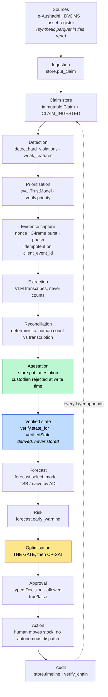
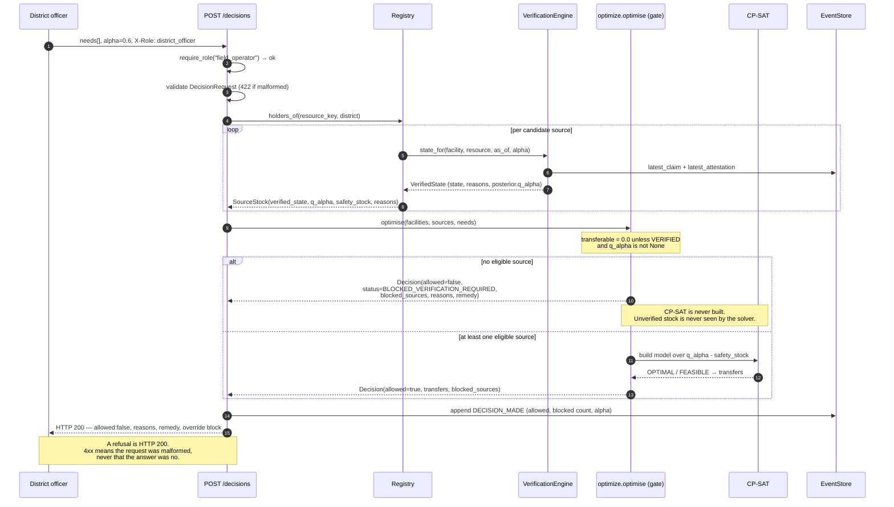
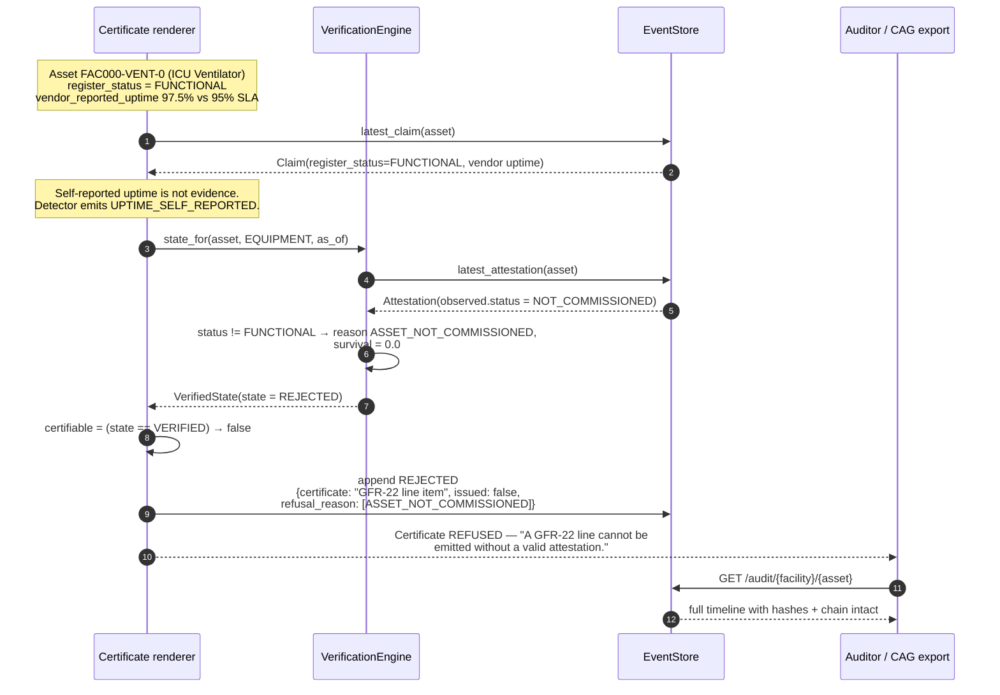
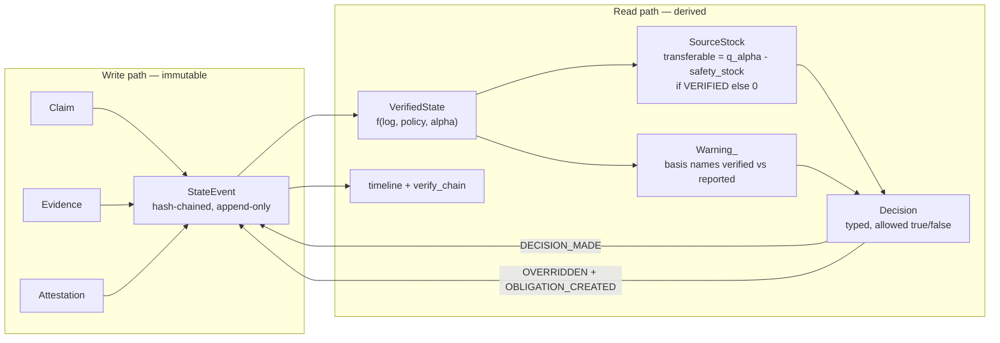
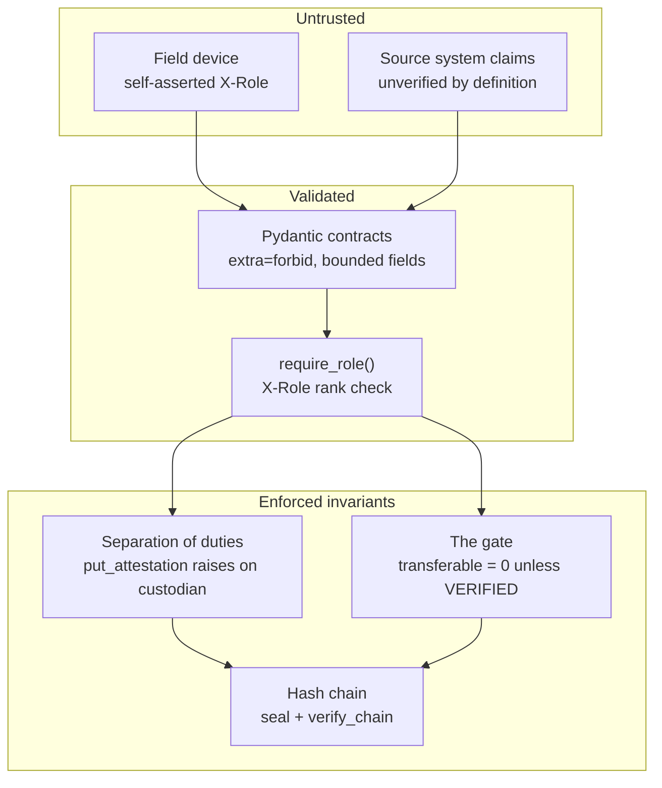

# 04 — System Design & Architecture

Describes the architecture as implemented. **All data is SYNTHETIC.** Anything not implemented is labelled as a limitation rather than described in the present tense.

---

## 1. Architectural shape

Tathyon is a layered pipeline over an append-only event log. Each layer has one responsibility and hands the next a typed object. The only writable store is the log; everything a consumer reads is a projection of it.



The gate (highlighted) is the whole product in one function. Everything above it exists to make the gate's input trustworthy; everything below it exists to make the gate's refusal legible.

## 2. Component responsibilities

| Component | File | Responsibility | Explicitly not its job |
|---|---|---|---|
| Object model | `tathyon/schema.py` | Define the four immutable write objects, the derived projection, the closed enumerations and the 25 reason codes. Hash any object deterministically. | Business logic. It holds no behaviour beyond `digest()` and `seal()`. |
| Event store | `tathyon/store.py` | Append-only writes, hash chaining, idempotency on `client_event_id`, per-resource timeline, chain verification. Reject custodian self-attestation. | Interpretation. It never computes a state. |
| Detection | `tathyon/detect.py` | Tier-1 hard violations (10 columns, free labels) and tier-2 weak features (8, observed-data only). Emit reason codes. | Deciding anything. It flags; it does not gate. |
| Verification engine | `tathyon/verify.py` | Project the log into a `VerifiedState` as a pure function of (log, policy, α). Gamma-Poisson posterior for quantities, discrete-time hazard for equipment. Order the queue. | Persisting anything. It writes nothing. |
| Forecasting | `tathyon/forecast.py` | Intermittent-demand models, per-series selection by ADI, lead-time distributions, four-level early warning with a written explanation and a `basis` field. Honest evaluation. | Reading the ledger's verification status. It takes a quantity and a basis label from its caller. |
| Optimisation | `tathyon/optimize.py` | Run the gate, then CP-SAT. Return a typed `Decision`. Run the naive counterfactual on the identical solver. | Raising on a refusal. A refusal is data. |
| Evaluation | `tathyon/eval.py` | Leakage guards, weak-supervision training, yield curve, effort-to-catch, the three "unusual ≠ wrong" detectors. | Flattering the model. Both arms are reported. |
| Pipeline | `tathyon/pipeline.py` | Execute the whole loop end to end and write `artifacts/demo_scenario.json`. Every number computed, nothing hardcoded. | Selecting a favourable scenario. The donor is chosen by the system's own operational rule — the largest reported balance among detector-flagged records. |
| Generator | `tathyon/generator.py` | Produce the SYNTHETIC corpus with `truth` and `observed` as **separate tables**, so labels come from comparing them and features are computable from `observed` alone. | Being evidence of anything real. |
| API | `api/main.py` | Validated HTTP transport over the core. Bootstrap the store from parquet. RBAC boundary demonstration. | Business logic. It contains none, and no mock data. |

## 3. Sequence diagrams

### 3.1 The blocked-transfer path



Covered by `test_gate.py::test_02_unverified_stock_is_blocked_with_reasons` and `test_api.py::test_blocked_decision_returns_200_with_allowed_false`.

### 3.2 Offline capture and sync

```mermaid
sequenceDiagram
    autonumber
    participant FO as Field operator (offline)
    participant DEV as Device queue
    participant API as API
    participant ST as EventStore
    participant ENG as VerificationEngine

    Note over FO,DEV: Network unavailable
    API-->>DEV: nonce issued earlier with the task<br/>(nonce, nonce_issued_at)
    FO->>DEV: capture 3-frame burst with nonce in frame
    DEV->>DEV: artifact_hash, perceptual_hash,<br/>client_event_id (idempotency key)
    FO->>DEV: human counts; adapter transcribes the register
    FO->>DEV: in-charge (not the custodian) signs attestation,<br/>seconds_spent recorded
    Note over DEV: Both queued locally

    Note over DEV,API: Network returns — partial sync, then a retry of the WHOLE queue
    DEV->>API: POST /evidence (client_event_id)
    API->>API: evidence_id = sha256(facility|resource|client_event_id)
    API->>ST: put_evidence → append EVIDENCE_CAPTURED
    ST-->>API: StateEvent(offset=n)
    API-->>DEV: 200 duplicate=false, event_offset=n<br/>warn SINGLE_FRAME_CAPTURE if frame_count < 3

    DEV->>API: POST /evidence (SAME client_event_id) — replay
    API->>ST: append() sees client_event_id already applied
    ST-->>API: None
    API-->>DEV: 200 duplicate=true, events_after == events_before

    DEV->>API: POST /attestations (client_event_id, is_custodian=false)
    API->>ST: put_attestation
    alt is_custodian = true
        ST-->>API: ValueError
        API-->>DEV: 422 ATTESTOR_IS_CUSTODIAN + remedy
    else accepted
        ST-->>API: append ATTESTED
        API->>ENG: state_for(...) recompute
        ENG-->>API: VerifiedState
        API-->>DEV: 200 resulting_state<br/>warn RUBBER_STAMP_SUSPECTED if seconds_spent < 20
    end
```

`occurred_at` and `recorded_at` are distinct throughout, so a three-day-late sync records both when the observation happened and when the server learned of it. Covered by `test_api.py::test_evidence_submission_is_idempotent` and `test_gate.py::test_07_replayed_client_event_id_appends_exactly_once`.

### 3.3 The refused GFR-22 certificate



The refusal itself is a ledger event. An auditor can see that a certificate was requested, refused, and why — which is a stronger artefact than a certificate that was quietly not produced.

**Limitation.** No GFR-22 form is rendered. What exists is the refusal decision (`pipeline.py`, `certifiable`) and the ledger event. Producing the policy-based document is on the roadmap.

## 4. Data flow



Three properties hold by construction:

1. **Nothing in the read path is stored.** `VerifiedState`, `SourceStock`, `Warning_` and `Decision` are constructed per request.
2. **Every consequential read-path output feeds back as a write.** A decision, including a refusal, and every override land on the log.
3. **The reported figure never reaches the solver.** It reaches `SourceStock.reported_qty` for display and for the counterfactual, and `transferable` is computed from `q_alpha` alone.

## 5. Failure modes per layer

| Layer | Failure | Behaviour | Where |
|---|---|---|---|
| Ingestion | Parquet missing or unreadable | 503 `DATA_UNAVAILABLE` with the underlying error; `/health` reports `degraded` | `reg()`, `Registry._load` |
| Ingestion | Naive vs aware timestamps mixed | All timestamps normalised to tz-aware UTC on entry | `_utc_iso`, `Registry._load` |
| Detection | Non-numeric / NaN / infinite quantity | Coerced, loss recorded, `NON_FINITE_QUANTITY` raised. **Never a crash** — one corrupt cell must not take down the batch | `hard_violations` |
| Detection | Empty frame | Correctly-shaped empty frame with declared dtypes | `hard_violations` early return |
| Detection | First row of a series | Not flagged for arithmetic; the identity is undefined without an opening balance | `prev_stock.notna()` guard |
| Prioritisation | Model learns facility identity, not wrongness | D1/D2/D3 detectors run and both arms are reported. **D1 fired; residualisation did not fix it** — retained and documented, not deleted | `eval.unusual_not_wrong` |
| Evidence | Replayed offline queue | Idempotent no-op; `duplicate: true`, event count unchanged | `EventStore.append` client-id dedupe |
| Evidence | Fewer than 3 frames | Accepted with `SINGLE_FRAME_CAPTURE` warning | `submit_evidence` |
| Evidence | Re-used image | **Undetected.** `perceptual_hash` is stored; nothing compares it. `EVIDENCE_REUSED` is never emitted | limitation |
| Extraction | Model disagrees with the human by >5% | `CONFLICTED`, not `VERIFIED` | `state_for` |
| Extraction | Model abstains | Recorded in `extraction_abstained`; the human count stands | `Evidence` |
| Attestation | Custodian attempts to attest | `ValueError` at write time → 422 with a remedy naming who may attest | `put_attestation` |
| Attestation | Completed in under 20 s | `CONFLICTED` with `RUBBER_STAMP_SUSPECTED`, warned at submission | `state_for`, `submit_attestation` |
| Attestation | Older than the policy window | Projects back to `UNVERIFIED` with `ATTESTATION_STALE` — **with no new event**, because staleness is a read-time projection | `state_for` |
| Projection | No attestation at all | `UNVERIFIED` / `NO_ATTESTATION`. Fails closed | `state_for` |
| Projection | Series with no history (cold start) | Weak default prior widens the posterior, `q_alpha` collapses toward zero, the gate says "verify first". **This is the correct answer, not a bug** | `ConsumptionPrior` defaults |
| Forecast | Zero-demand days | MASE and pinball are defined on zeros; MAPE deliberately not reported | `forecast.mase` |
| Optimisation | Unknown facility | Named `ValueError` → 422. Never a bare `KeyError`, never a silent drop that would masquerade as a legitimate refusal | `optimise` integrity block |
| Optimisation | Solver infeasible or timed out | Deterministic greedy fallback, marked `GREEDY_FALLBACK`. Worse, explainable, never frozen | `greedy_fallback` |
| Optimisation | No verified source in range | `NO_SAFE_SOURCE` with a remedy to escalate to district procurement rather than move unverified stock | `optimise` |
| Approval | Override of an allowed decision | 409 `NOTHING_TO_OVERRIDE` | `override_decision` |
| Approval | Override with a free-text reason | 422; the reason code must be one of five | `OverrideIn._closed_list` |
| Approval | Obligation deadline passes | **Nothing happens.** No scheduler runs. The escalation text describes a process that does not exist | limitation |
| Audit | Payload mutated in place | `verify_chain` returns the first bad offset; `/health` → 503 | `verify_chain` |
| Audit | Event deleted | Detected — the chain breaks at the successor's `prev_hash` | `test_08b_chain_detects_a_deleted_event` |
| Audit | Whole log rewritten by a party with write access | **Not detectable from the chain alone.** Stated in `/health`'s own response | `09_SECURITY.md` |
| Persistence | Process restart | **Everything is lost.** In-memory store, write-only `save()`, no load | limitation |

## 6. Scaling analysis

The compute story is uninteresting, and saying so is the point.

**What compute costs.** CP-SAT is bounded at 5 seconds with a greedy fallback. The projection is a function over one resource's attestations. Detection is vectorised pandas over the ledger. Evaluation trains one gradient-boosting model over 39,000 rows. A district is 20 facilities × 10 SKUs. None of this is a scaling problem; it is a laptop.

**Where it would bind first, in order.** `verify_chain()` is O(n) over the entire log and runs on every `/events` and `/audit` request. `attestations_for` scans all attestations. `GET /events` filters in Python from offset 0. These are index-and-incremental-verification problems with textbook fixes, and none of them is the ceiling.

**The actual ceiling is human verification capacity.** The system's output is only as good as the attestations feeding it, and every attestation costs a person a walk to a shelf and a count. On the synthetic corpus, catching 50% of materially-wrong records takes ~37% fewer verifications when ranked than at random — but it still takes verifications. With a base rate of 1.8%, most of what a verifier checks will be fine. That is the arithmetic of the problem, and no amount of modelling removes it. The trust model's job is to improve the constant factor on a fundamentally human budget; measured at PR-AUC 0.079 against a 0.053 base rate, it improves it modestly. Scaling Tathyon to a state means scaling attesters, not servers.

**The second ceiling is per-state integration headcount.** Every state runs a different instance of e-Aushadhi or DVDMS, with different schemas, different custodianship conventions and a different asset register. The ingest adapter in this repository reads parquet files this repository generated. A real adapter per state is an integration engagement, not a configuration file, and that engagement — not compute, not model quality — sets how fast the system can reach a second district.

**What the architecture does buy at scale, honestly.** Append-only, hash-chained, idempotent-on-`client_event_id`, with a projection that is a pure function of the log — these are the properties that permit partitioning by facility, tailing by offset, and replay after a policy change without a backfill. They are real design choices and they are implemented in the primitive. But the store is an in-memory Python list. **Nothing has been run at scale, and no claim here should be read as though it had.**

## 7. Security boundaries



| Boundary | What holds | What does not |
|---|---|---|
| Transport → API | Every field is bounded and typed; `extra="forbid"` makes an unexpected field a 422 | No TLS configuration, no rate limiting, no request signing |
| API → authorisation | Role ranks gate attestation (≥ `facility_incharge`) and override (`medical_officer`) | **`X-Role` is self-asserted**: no signature, no session, no identity provider, no revocation. Demonstrates where boundaries sit; does not enforce them against an adversary |
| Authorisation → write | Custodian self-attestation raises in the store itself, not in a validator that could be bypassed by another caller | Nothing verifies the claimed `attestor_id` is a real person, or that the `delegation_id` exists |
| Write → ledger | Append-only, hash-chained, idempotent | Tamper-**evident** only: a full-log rewrite by a party with write access is undetectable from the chain alone. No external anchoring |
| Evidence → trust | Server nonce, 3-frame burst, perceptual hash, cryptographic hash of bytes | Nothing checks the nonce is visible in the frame; nothing compares the perceptual hash against history. `EVIDENCE_REUSED` never fires |
| Attestation → signature | Field exists and is carried on the event | `sha256(attestation_id)[:32]` is **not a signature**. No keypair, no hardware, no verification |
| Data → provenance | Every payload carries `provenance`; `_envelope` stamps it | Enforcement is by convention within this codebase |
| Privacy | No patient entity exists in the object model. Attendance deliberately excluded under DPDP Act reasoning | — |

Full threat model in `09_SECURITY.md`.

## 8. The four-object model, and why computed values are never frozen

### 8.1 The objects

**Four immutable write objects.** `Claim` (what a system asserts), `Evidence` (what a device captured), `Attestation` (what a human signed), `StateEvent` (the ledger entry sealing all of it). The first three are `@dataclass(frozen=True)`. The fourth is append-only and hash-sealed. There is no update path and no delete path anywhere in `EventStore`. A correction is a new object that supersedes its predecessor.

**One derived read projection.** `VerifiedState` is recomputed per (resource, ledger offset, policy version, α) by `verify.VerificationEngine.state_for`. It is never written to a table. `SourceStock`, `Warning_` and `Decision` are likewise constructed per request and thrown away.

The separation is the whole trust model in structural form. A claim is *someone's assertion*. An attestation is *someone else's assertion, with evidence, under separation of duties*. A state is *what those two, plus a policy, imply right now*. Collapsing any two of those into one row destroys the ability to say which one was wrong.

### 8.2 Why computed values are never frozen into storage

Four reasons, each of which is a failure that would have happened otherwise:

**1. A computed value is a function of a versioned policy.** `VERIFIED` means "attested within 30 days by a non-custodian who spent more than 20 seconds". Change `max_attestation_age_days` from 30 to 21 and every stored status is wrong. Freezing status into a column turns every policy change into a backfill over the entire corpus — and a backfill is a write, which means the stored history now depends on when you ran the migration.

**2. Different consumers need different answers from the same facts.** α is supplied by the consumer because the consumer owns the risk: a policy-based certificate that over-claims stock is catastrophic (α ≈ 0.98), while an optimiser that can re-plan is not (α ≈ 0.6). A single stored `available_qty` would have to pick one, and would be wrong for the other. `quantity_posterior` returns the posterior and lets the caller take the quantile it can defend.

**3. `STALE` must not exist as a state.** This is the sharpest case. Staleness is a function of the current clock: a record that was `VERIFIED` yesterday is stale today with no event in between. If staleness were a stored state, a record would change state with nothing on the log to explain it — and the log would no longer reproduce the state. So `VerificationState` has no `STALE` member (the enum says so in its own docstring), and `ATTESTATION_STALE` is a reason code produced at read time by comparing `as_of` against the anchor.

**4. Replayability is the audit property.** `verify_chain()` recomputes every hash from genesis; `state_for()` recomputes every status from the log. Together they mean an auditor can be handed the event log and independently reproduce every state the system ever acted on. The moment a computed value is stored, the auditor must instead trust that the value was computed correctly at the time, by code that may since have changed — which is exactly the trust the product exists to remove.

The cost is real and accepted: every read recomputes, `attestations_for` scans, and there is no cached status column to index on. That is a performance problem with known fixes. A frozen status is a correctness problem with none.

---

*Cross-references: `01_PRD.md` (product scope and non-goals), `02_FRD.md` (numbered requirements with test citations), `03_SRS.md` (API surface, data model, non-functional requirements), `07_DATA_PROVENANCE.md`, `08_MODEL_CARD.md`, `09_SECURITY.md`, `14_LIMITATIONS.md`.*
