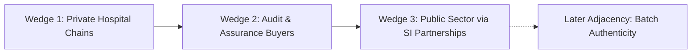

# 15 — Startup Path & Expansion Plan (PLAN ONLY)

> ⚠️ **STATUS: PLAN ONLY. NO TRACTION CLAIMS.**
> We do NOT have pilots, government contracts, signed MOUs, paying customers, or verified revenues. All market entry concepts, wedge timelines, and economics described below represent strategic design intent and execution hypotheses, not accomplished milestones.

---

## 1. Problem Statement & External Anchors (Evidence, Context, Limits)

These sources support research questions, not TATHYON performance, legal authority, a current state-wide diagnosis, or market demand:

1. **NHM 17th Common Review Mission (2025; published 2026)** reports e-Aushadhi use in Madhya Pradesh alongside facility-level availability gaps, some essential-drug stock-outs, procurement lead times, and inconsistent forecasting/physical verification in visited facilities. It is a state- and visit-specific review, not a national prevalence estimate. [Report](https://nhm.gov.in/New-Update-2024-26/CRM/17th-CRM-2025.pdf)
2. **CAG Uttarakhand public-health audit** reports incomplete e-Aushadhi facility coverage and non-real-time data entry for the audited period. Do not generalize those findings to other states or current deployments. [Report](https://cag.gov.in/uploads/download_audit_report/2024/Report-No.-3-of-2024_PA-on-PHIMHS-GoUK_English-067b70f865ca290.98427914.pdf)
3. **C-DAC describes DVDMS/e-Aushadhi** as covering drug procurement, inventory, receipt/issue and distribution. TATHYON must complement an authorized incumbent workflow, not claim to invent inventory management. No generally available API for a specific state deployment was verified in this research pass; state integrations must be confirmed with the data owner/C-DAC. [C-DAC DVDMS overview](https://cdac.gov.in/index.aspx?id=project_details&projectId=DrugandVaccineDistributionManagementSystem%28DVDMS%29)
4. **BRICS 2026 health meetings and declarations** include broad cooperation on health systems, digital health, preparedness and access to medical products. They do not establish a BRICS inventory-verification standard, TATHYON endorsement, or agreement to federate TATHYON models. [MoHFW meeting outcome](https://www.pib.gov.in/PressReleasePage.aspx?PRID=2288267&lang=2&reg=48), [New Delhi Declaration](https://www.pib.gov.in/PressReleseDetailm.aspx?PRID=2309505&lang=1&reg=3)
5. **Nature's Sierra Leone study** reports an estimated 19% increase in consumption of allocated products after a government decision-support deployment. This is an external result from a different system, country, intervention and evaluation. It does not validate TATHYON's synthetic results or its verification-gated allocation thesis. [Nature article](https://www.nature.com/articles/s41586-026-10433-7)
6. **Secondary Kerala reporting** in September 2026 describes an RTI reply about expired medicines in KMSCL warehouses and non-consolidated details. Treat the report as a lead to obtain the underlying RTI response, not as a fully audited quantity/category estimate or national finding. [News report](https://timesofindia.indiatimes.com/city/kochi/kmscl-hasnt-disposed-expired-medicines-since-2021/articleshow/134465586.cms)

The previous claims about a 2026 CAG Rajasthan health-supply audit and an August 2026 Pratapgarh incident are removed because this review did not verify them in primary sources. The exact claims about anti-counterfeiting frameworks are also removed pending a source. The working product hypothesis is to close authorized, evidence-backed stock exceptions; it remains unvalidated with users and buyers.

---

## 2. Commercialization Wedges (Strict Sequencing)

Public-sector purchasing and integration paths vary by state and sponsoring body. The following are discovery hypotheses, not a proven sales sequence, procurement-cycle estimate, or buyer commitment:

### Wedge 1: Private Hospital Networks (Fastest Path to Test, Not Yet Validated)
- **Target Buyer**: Chief Operating Officer (COO), Chief Financial Officer (CFO), or Central Pharmacy Director of private tertiary hospital networks (e.g. Apollo, Manipal, Max Healthcare, Fortis).
- **Core Value Proposition**:
  - Hypothesis to test: evidence-backed reconciliation might help reduce unresolved discrepancies, emergency purchase friction, or expiry exposure.
- **Sales Motion**: Explore a permissioned, shadow-mode export-and-reconciliation pilot. Price, data-access route, measurable ROI, and sales timeline are unverified.
- **Why Test First**: A private group may have more direct contracting authority than a state deployment, but neither willingness to pay nor access to suitable independent attestation data has been verified.

### Wedge 2: Audit, Donor, & Quality Assurance Buyers (Verification-as-a-Service)
- **Target Buyer**: Third-Party Monitoring Agencies (TPMA), multilateral health funds (Global Fund, Gavi, USAID contractor consortia), and internal audit committees.
- **Core Value Proposition**:
  - Verification targeting as an intelligent audit engine: instead of conducting arbitrary 5% random physical stock audits across thousands of dispersed clinics, Tathyon’s Trust Scorer identifies the facilities whose discrepancies represent the highest financial or clinical risk.
  - Generates immutable, hash-chained evidence trails proving physical count completion (`attester != custodian`).
- **Sales Motion**: Audit-seat licensing or per-inspection-campaign service contracts.

### Wedge 3: Public Sector via System Integrator (SI) Partnerships (Never Direct Sales First)
- **Target Channel**: Global and national SIs (e.g. NIC, C-DAC, Tata Consultancy Services, Wipro, PwC India) bidding on or maintaining state health IT infrastructure (e-Aushadhi, DVDMS).
- **Core Value Proposition**:
  - Operates as the **resilient lateral transfer execution sidecar** embedded within e-Aushadhi’s Transfer Management Module.
  - Does not replace the sovereign system of record; ingests scheduled CSV/API exports and emits signed, staged dispatch vouchers for human statutory authorization.
- **Why Partner**: Insulates the company from public procurement cycle risk while providing immediate state-wide distribution footprint.

---

## 3. Technology Adjacencies (Future Roadmap)

- **Batch Authenticity & Track-and-Trace Integration**:
  - Once a lawful source and physical-verification cadence are established, assess whether source systems expose GS1/DataMatrix identifiers and what current Indian track-and-trace requirements apply. Do not assume barcode coverage, access, or verification capability before checking current primary regulations and the pilot state’s workflow.
- **Disaster Response & Cold-Chain Telemetry**:
  - Integrating low-cost passive temperature logger NFC dumps into the attestation payload to disqualify heat-compromised vaccine lots before lateral dispatch.

---

## 4. Explicit Negative Claims (What We Do NOT Claim)

1. **No Live Integrations**: We are NOT integrated into e-Aushadhi, DVDMS, or HMIS.
2. **No Commercial Traction**: We have 0 paying clients, 0 letters of intent, and $0 ARR.
3. **No Clinical Proof**: We have not demonstrated clinical outcomes or reduced mortality in live patient populations.
4. **No Government Endorsement**: No state drug controller or health department has endorsed or reviewed this software.
